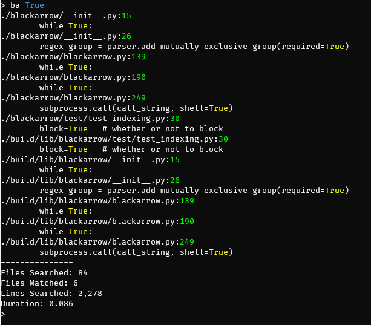
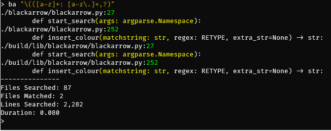

"Universal" Text Finder
=======================

[](https://travis-ci.org/TheDataLeek/black-arrow)
[](https://coveralls.io/github/TheDataLeek/black-arrow?branch=master)

It's basically just grep in python... Nothing fancy, just an easy extensible way
to find things....

Yeah, I know, it's "reinventing the wheel" but ehhh, this is easier to extend to
cover any and all weird cases without having to memorize a bunch of obscure
combinations of bash commands.

That out of the way, let's talk about what this *actually does*...

## Quick Overview

Essentially Black Arrow (or `ba` for short) is a way to search through every line in every file and
find matching keyword *or* regular expressions. It uses smart case, so if the search term is all
lowercase it defaults to case-insensitive (mostly for ease of use).



You can also supply it with regular expressions and it handles them natively.



Other features include -

* excluding certain files or paths,
* replacing any matches that have been found,
* specifying the max depth to search (good for large directory structures),
* "pipe" mode for unix piping,
* open the files in the `$EDITOR` for manual parsing. 

## Installation

```
┬─[zoe@fillory:~/Dropbox/Projects/black-arrow]─[09:22:12 PM]
╰─>$ pip install --user blackarrow
```

## Black-Arrow Script

```bash
┬─[zoe@fillory:~/Dropbox/Projects/black-arrow]─[09:33:40 PM]
╰─>$ ./black-arrow/blackarrow.py -h
usage: ba [-h] [-d DIRECTORIES [DIRECTORIES ...]] [-i IGNORE [IGNORE ...]]
          [-f FILENAME [FILENAME ...]] [-w WORKERS] [-p] [-e] [-l]
          [-r REPLACE] [-D DEPTH] [--dev]
          R

positional arguments:
  R                     Search term (regular expression)

optional arguments:
  -h, --help            show this help message and exit
  -d DIRECTORIES [DIRECTORIES ...], --directories DIRECTORIES [DIRECTORIES ...]
                        Director(y|ies) to run against
  -i IGNORE [IGNORE ...], --ignore IGNORE [IGNORE ...]
                        Things to ignore (regular expressions)
  -f FILENAME [FILENAME ...], --filename FILENAME [FILENAME ...]
                        Filename search term(s)
  -w WORKERS, --workers WORKERS
                        Number of workers to use (default numcores, with
                        fallback 6 unless set)
  -p, --pipe            Run in "pipe" mode with brief output
  -e, --edit            Edit the files?
  -l, --lower           Check strict lower case?
  -r REPLACE, --replace REPLACE
                        Replace text found in place with supplied
  -D DEPTH, --depth DEPTH
                        Directory depth to search in
  --dev                 Run in development mode (NO OUTPUT)
```

#### The Name

*"Arrow! Black arrow! I have saved you to the last. You have never failed me and
I have always recovered you. I had you from my father and he from of old. If
ever you came from the forges of the true king under the Mountain, go now and
speed well!"*

― J.R.R. Tolkien, The Hobbit
